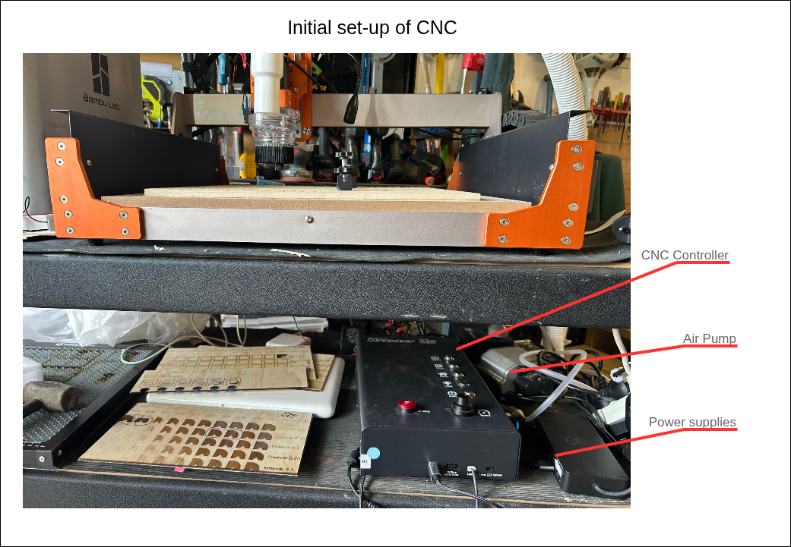
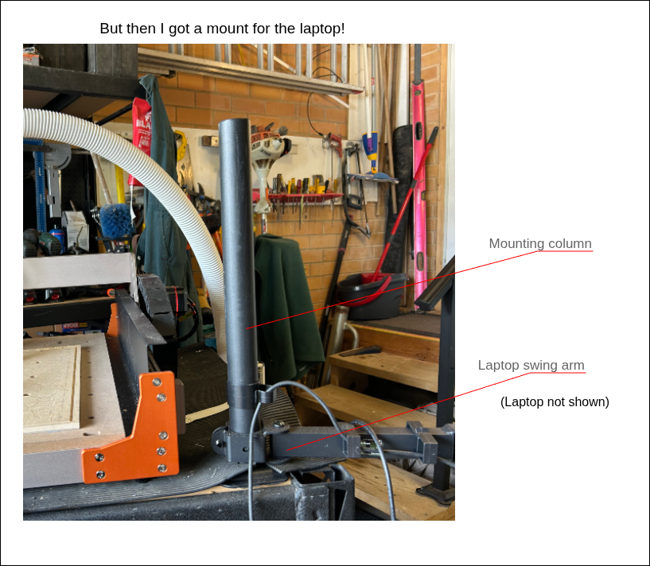
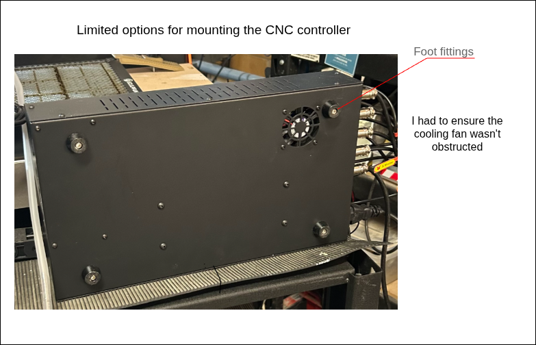
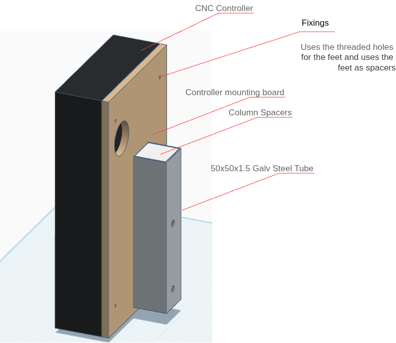
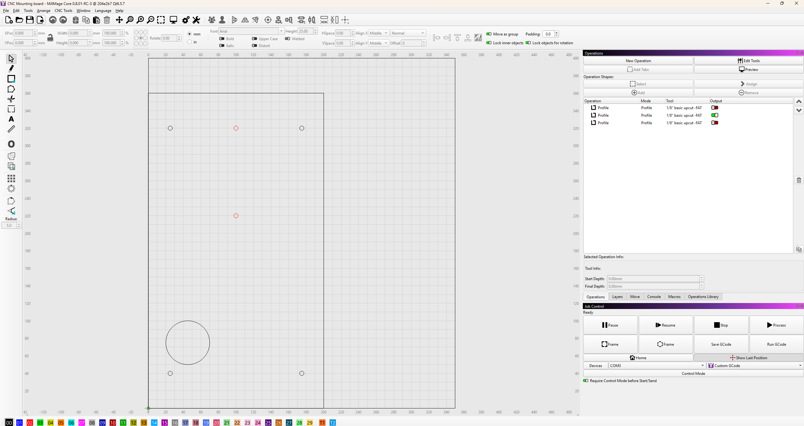
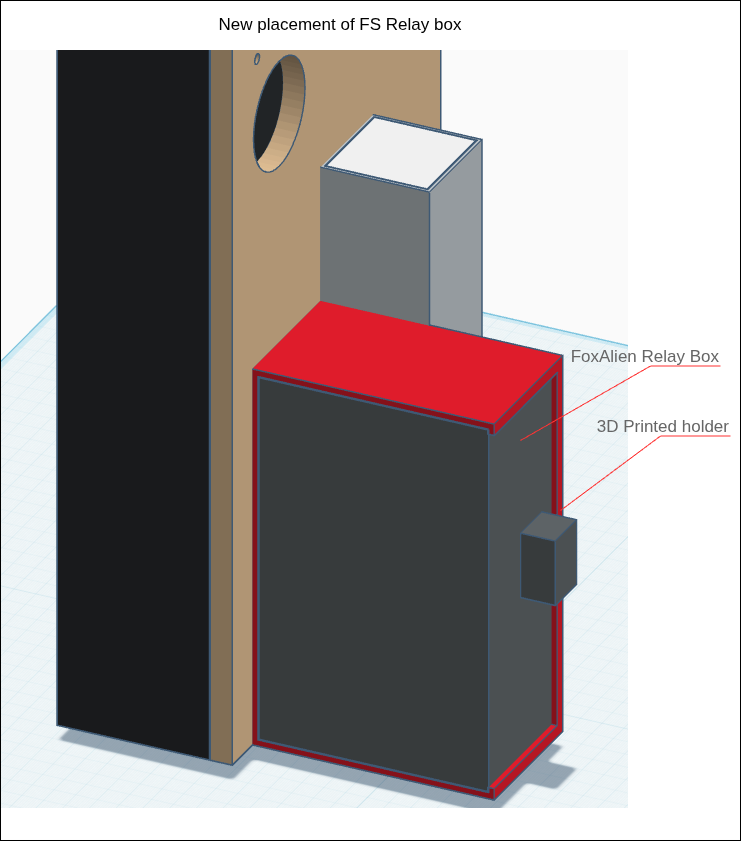
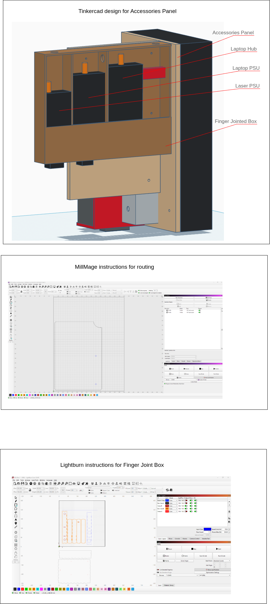
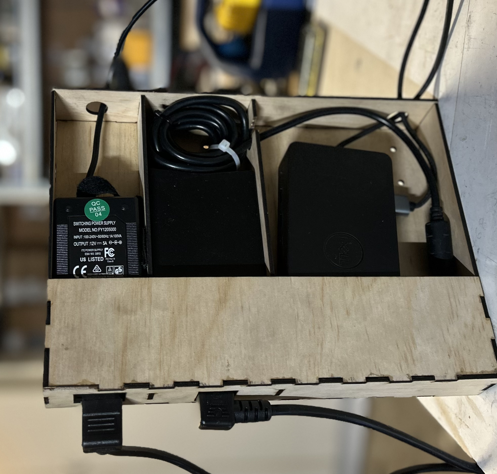
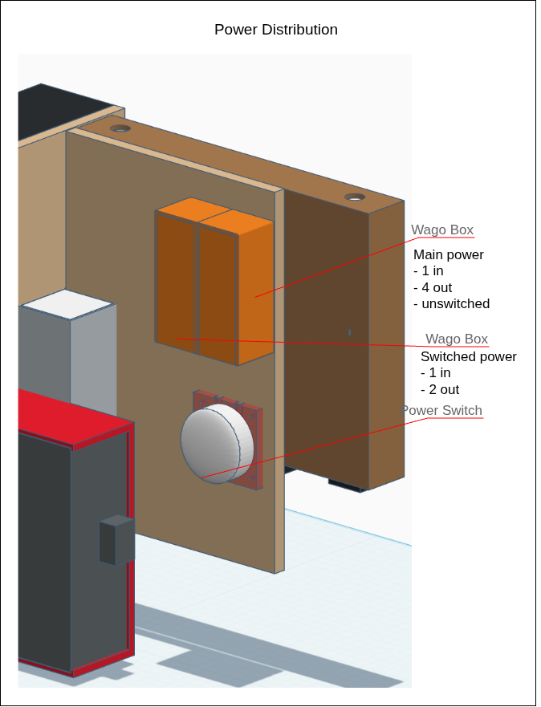

# Three-Day-Tidy-up

Improving the setting of my CNC

## Repository Purpose

This repository documents the project.  Using the 'GROW' model, I set about improving the arrangement of my new CNC in my workshop.
The repository holds design information and shows the workflow to achieve the outcome.
It is made public to be shared with members of the [Melbourne Mechanics Guild](https://techguilds.au/mechanics-guild/)

## Goal

Without significant cost, to organise the setting of the CNC with all of its components into a more 'workable' solution.

## Reality

I received delivery of my new CNC in November 2025.  The device chosen is a [FoxAlien Masuter 3S](https://www.foxalien.com/en-au/products/cnc-router-masuter-3s) system with a 400x400mm working area.  It is very much an entry level device but has features like the NEMA23-76 closed-loop stepper motors.

I'd love a full sheet machine but i'm limited by space and money!

I realised that I needed 360 degree access to the CNC and it is surprisingly heavy!
I decided to dedicate my mobile bench to the machine but to share it with my 3D printer.

This meant the there wasn't sufficient space on the surface of the bench for the controller unit and the various other components attached.  These all had to go on the shelf below.  Even worse, I had to use a separate table to put my laptop on.

### Upgrade 1 - Laptop Mount

I picked up a column mount and VESA swing arm (cheap from Aldi) and added a Laptop VESA Mount(from Desky)

However, there were several issues with this setup:

- Access to the CNC controller and in particular the Emergency STOP!
- Numerous power supply units floating around
- 5 240v connections to a power board
- Untidy cabling
- Valuable shelf space poorly utilised
- Trailing cable and air supply tube for the laser which could not be incorporated in the drag chain.

## Options and Obstacles

### Upgrade 2 - Console Mount

With the new mounting column I had an opportunity to make a support for the CNC controller.

For this and the following upgrades in this project I used [Tinkercad](https://www.tinkercad.com/things/eOdKAXNBJg2-copy-of-cnc-controller-mount?sharecode=ibuiFz7KEafDsxCg2Hafcm8XH_6VspHkw7Cs92L24GY) to design the component parts.  I have the original of the Tinkercad design, you are welcome to explore this one!

The detail of the Controller Mounting Board was transferred as .svg to MillMage for routing on the CNC.

#### VIDEOS - TL;DR

Then assembled:

[Assembly - part 1](https://youtu.be/Rip-IDQhKRQ) - Assembly of Column Tube with spacers and back plate
[Assembly - part 2](https://youtu.be/sWca06nICo0) - Fitting assembled column tube to back panel
[Assembly - part 3](https://youtu.be/u4nsY6Cjvho) - Fitting cap retention screw
[Assembly - part 4](https://youtu.be/CADHhxAHr6o) - Back panel mounted on Column post

[Result of Upgrade 2](https://youtube.com/shorts/3-vjdydDyPs?feature=share)

### Upgrade 3 - Mounting Accessories

This was a big improvement, freeing up the swing arm for the laptop.

I still had the various PSUs to deal with so created an accessories panel to be cut from 10mm MDF and then designed a laser-cut finger jointed box from 3mm plywood

[Routing the accessories panel(video)](https://youtu.be/m_YkWWMEXUo)

## Upgrade 4 - Simplify power cables

By replacing the collection of power cables with shortened cables fed from a Wago connector distribution box, I was abe to contain all the power distribution from the accessory board and provide a switch circuit for controlling the Laser and Air supply power.  

## What's Next

- Cut and apply labels
- Fix cables to accessory panel
